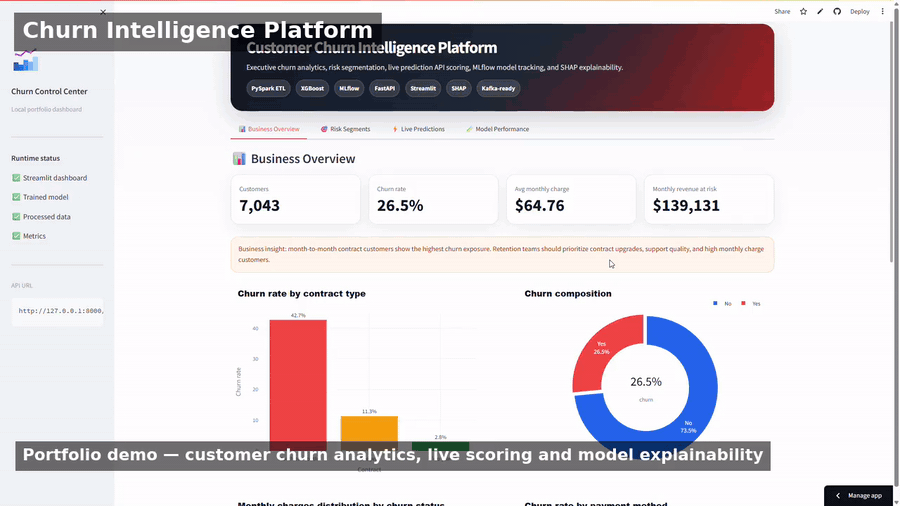
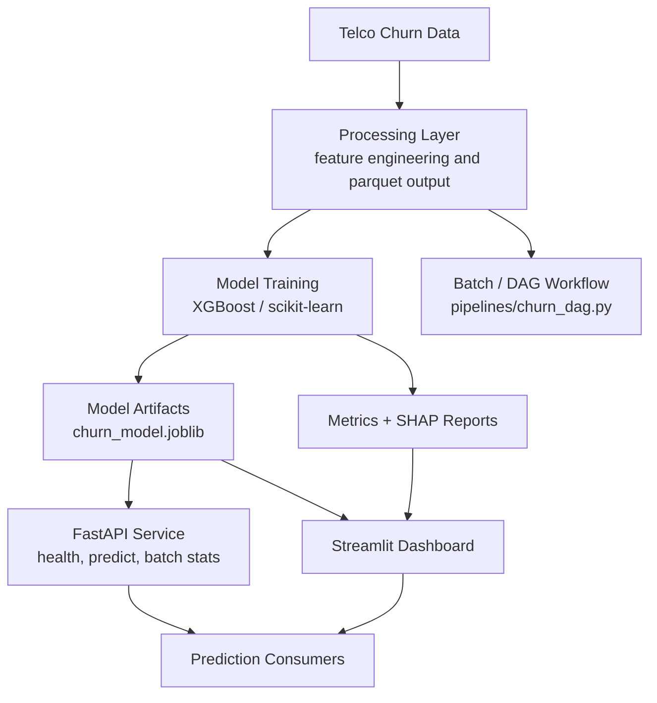

# Customer Churn Intelligence Platform

**Live Application:** [Open Streamlit App](https://customer-churn-intelligence-platform-gleon7xy6mucndm74impde.streamlit.app/)

**GitHub Repository:** [praveenraj9623-sketch/customer-churn-intelligence-platform](https://github.com/praveenraj9623-sketch/customer-churn-intelligence-platform)

> A production-style churn intelligence platform with feature engineering, XGBoost modeling, SHAP interpretation, MLflow tracking, FastAPI prediction service, Docker workflow, and a Streamlit business dashboard.

**[Open Live App ->](https://customer-churn-intelligence-platform-gleon7xy6mucndm74impde.streamlit.app/)**

[](https://python.org)
[](https://streamlit.io)
[](https://fastapi.tiangolo.com)
[](https://xgboost.readthedocs.io)
[](https://mlflow.org)
[](https://docker.com)

[](https://praveenraj9623-sketch.github.io/)
[](https://github.com/praveenraj9623-sketch/customer-churn-intelligence-platform)

---

## Demo Preview



---

## What is This Project?

The Customer Churn Intelligence Platform predicts churn risk, segments customers by risk level, explains key churn drivers, and exposes predictions through both a dashboard and API. It is structured like an applied customer analytics system rather than a single notebook.

**Core outcome:** raw customer data -> feature pipeline -> churn model -> risk segmentation -> SHAP insights -> API + dashboard delivery.

---

## Business Value

| Business capability | Implementation |
|---|---|
| Identify likely churners | XGBoost model and churn probability scoring |
| Prioritize retention action | Risk segments and dashboard filters |
| Explain churn drivers | SHAP summary and important features |
| Serve predictions | FastAPI `/predict` endpoint |
| Track model experiments | MLflow-ready training workflow |
| Package deployment | Docker and Docker Compose |

---

## System Architecture



---

## Tech Stack

| Category | Tools & Libraries |
|---|---|
| Data Processing | Pandas, NumPy, PyArrow, PySpark-style pipeline |
| Machine Learning | scikit-learn, XGBoost, joblib |
| Explainability | SHAP |
| Experiment Tracking | MLflow |
| API | FastAPI, Uvicorn, Pydantic |
| Dashboard | Streamlit, Plotly |
| Orchestration | pipeline DAG file |
| Deployment | Docker, Docker Compose |
| Testing | pytest |

---

## API Endpoints

Start the API locally:

```bash
uvicorn src.api.main:app --reload --host 0.0.0.0 --port 8010
```

Available endpoints:

| Method | Endpoint | Purpose |
|---|---|---|
| `GET` | `/health` | Service health check |
| `POST` | `/predict` | Predict churn risk for a customer payload |
| `GET` | `/batch-stats` | Return batch scoring statistics |

API docs:

```text
http://localhost:8010/docs
```

---

## Quick Start

```bash
git clone https://github.com/praveenraj9623-sketch/customer-churn-intelligence-platform.git
cd customer-churn-intelligence-platform
python -m venv .venv
.venv\Scripts\activate
pip install -r requirements.txt
streamlit run app.py
```

The local dashboard opens at:

```text
http://localhost:8501
```

---

## Docker Workflow

```bash
docker compose up --build
```

Common local services:

```text
Streamlit Dashboard: http://localhost:8510
FastAPI Docs:       http://localhost:8010/docs
MLflow UI:          http://localhost:5000
```

---

## Project Structure

```text
customer-churn-intelligence-platform/
|-- app.py
|-- Dockerfile
|-- docker-compose.yml
|-- requirements.txt
|-- pipelines/
|   `-- churn_dag.py
|-- data/
|   |-- raw/
|   `-- processed/
|-- models/
|-- reports/
|-- tests/
`-- src/
    |-- api/
    |-- ingestion/
    |-- modeling/
    |-- processing/
    `-- admin/
```

---

## Key Outputs

| Output | Description |
|---|---|
| `models/churn_model.joblib` | Saved churn prediction model |
| `reports/training_metrics.json` | Training and evaluation metrics |
| `reports/shap_summary.png` | Explainability summary |
| `data/processed/churn_features.parquet` | Feature-engineered dataset |
| `data/processed/indexer_labels.json` | Encoded label metadata |

---

## Running Tests

```bash
pytest -q
```

---

## Limitations

- The model is a portfolio-ready baseline and should be validated on current production data before operational use.
- Churn labels and customer behavior can drift over time.
- Retention decisions should combine model score, business policy, and customer context.

---

## Future Improvements

- Add scheduled retraining and model drift alerts.
- Add richer retention recommendation logic.
- Add authenticated API access.
- Add fairness and segment-level model monitoring.

---

## Author

Built by **Praveen Raj A**

- GitHub: https://github.com/praveenraj9623-sketch
- LinkedIn: https://www.linkedin.com/in/praveen-raj-a-b05abb2a3/
- Repository: https://github.com/praveenraj9623-sketch/customer-churn-intelligence-platform
- Live App: https://customer-churn-intelligence-platform-gleon7xy6mucndm74impde.streamlit.app/
