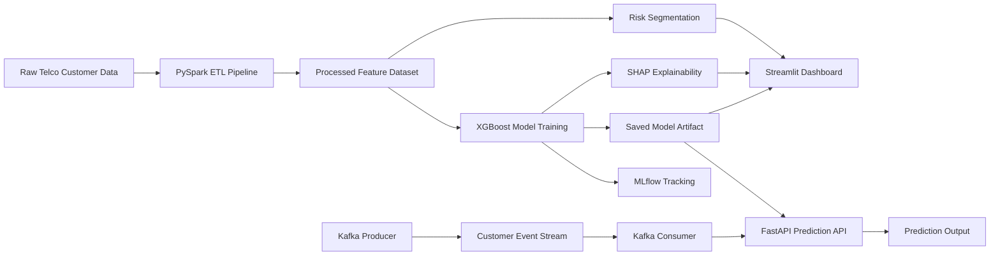

# Customer Churn Intelligence Platform


## Live Application

**Live Streamlit Dashboard:**
https://customer-churn-intelligence-platform-gleon7xy6mucndm74impde.streamlit.app/

---

## Project Summary

The **Customer Churn Intelligence Platform** is a production-style machine learning application built to predict telecom customer churn and convert model predictions into business-ready retention insights.

The platform combines data processing, machine learning, model explainability, API-based inference, dashboard analytics, experiment tracking, and real-time simulation components. It is designed to show how a churn prediction model can move beyond a notebook and become a usable business intelligence system for retention teams.

---

## Business Problem

Customer churn directly impacts recurring revenue in subscription-based businesses such as telecom, SaaS, banking, and insurance.

The key business questions solved by this project are:

* Which customers are most likely to churn?
* What are the main factors driving churn?
* Which customer segments should the retention team prioritize?
* How can churn predictions be served through an API?
* How can business users view churn insights through a dashboard?

---

## Key Features

* End-to-end customer churn prediction workflow
* PySpark-based ETL and feature engineering pipeline
* XGBoost machine learning model for churn classification
* MLflow experiment tracking for model metrics and run history
* SHAP and feature importance for model explainability
* FastAPI endpoint for real-time churn prediction
* Streamlit dashboard for business users and recruiters
* Risk segmentation across the full customer base
* High-risk customer prioritization table
* Kafka producer and consumer for simulated real-time customer events
* MongoDB-ready prediction storage workflow
* Airflow DAG skeleton for scheduled weekly retraining
* Docker-ready project structure

---

## Dashboard Modules

### 1. Business Overview

The dashboard provides a clear business-level summary:

* Total customers
* Overall churn rate
* Average monthly charges
* Revenue at risk
* Churn rate by contract type
* Churn composition
* Churn by payment method
* Monthly charge distribution
* Tenure vs monthly charge behavior

### 2. Risk Segments

Customers are scored and grouped into risk categories:

| Risk Segment | Meaning                                                  |
| ------------ | -------------------------------------------------------- |
| Low Risk     | Customers with low churn probability                     |
| Medium Risk  | Customers who require monitoring                         |
| High Risk    | Customers who should be prioritized for retention action |

The dashboard also highlights high-risk customers so business teams can act quickly.

### 3. Live Predictions

The application allows a user to enter customer profile details and generate churn risk predictions.

The prediction output includes:

* Churn probability
* Risk label
* Top prediction drivers
* Business-friendly interpretation

### 4. Model Performance

The model performance page displays:

* Accuracy
* AUC
* Precision
* Recall
* F1 score
* Feature importance
* Confusion matrix
* MLflow run summary

---

## Model Performance

Latest trained model performance:

| Metric    | Score |
| --------- | ----: |
| Accuracy  | 0.797 |
| AUC       | 0.842 |
| Precision | 0.648 |
| Recall    | 0.516 |
| F1 Score  | 0.574 |

The model achieves a strong AUC score, which is useful for ranking customers by churn risk. In real business use cases, ranking high-risk customers is often more important than only predicting a binary churn/no-churn label.

---

## Important Churn Drivers

The model identified the following major churn drivers:

* Contract type
* Internet service type
* Online security availability
* Technical support availability
* Customer tenure
* Monthly charges
* Total charges
* Payment method
* Paperless billing status

These insights help retention teams understand not only who may churn, but also why they may churn.

---

## Architecture



---

## Technology Stack

| Layer                  | Tools                                   |
| ---------------------- | --------------------------------------- |
| Programming            | Python                                  |
| Data Processing        | PySpark, Pandas, NumPy                  |
| Machine Learning       | XGBoost, scikit-learn                   |
| Experiment Tracking    | MLflow                                  |
| Explainability         | SHAP, Feature Importance                |
| API                    | FastAPI, Uvicorn                        |
| Dashboard              | Streamlit, Plotly                       |
| Streaming Simulation   | Kafka                                   |
| Database Integration   | MongoDB                                 |
| Workflow Orchestration | Airflow DAG Skeleton                    |
| Deployment             | Streamlit Cloud, Docker-ready structure |
| Version Control        | Git, GitHub                             |

---

## Project Structure

```text
customer-churn-intelligence-platform/
│
├── data/
│   ├── raw/
│   │   └── telco_churn.csv
│   └── processed/
│       ├── churn_features.parquet
│       └── indexer_labels.json
│
├── src/
│   ├── ingestion/
│   │   ├── kafka_producer.py
│   │   └── kafka_consumer.py
│   │
│   ├── processing/
│   │   └── spark_pipeline.py
│   │
│   ├── modeling/
│   │   ├── train.py
│   │   ├── evaluate.py
│   │   └── predict.py
│   │
│   ├── api/
│   │   └── main.py
│   │
│   └── admin/
│       ├── manage.py
│       ├── settings.py
│       ├── urls.py
│       └── churn_admin/
│
├── pipelines/
│   └── churn_dag.py
│
├── models/
│   └── churn_model.joblib
│
├── reports/
│   ├── training_metrics.json
│   └── shap_summary.png
│
├── tests/
│   └── test_model.py
│
├── app.py
├── requirements.txt
├── requirements-local.txt
├── docker-compose.yml
├── Dockerfile
├── .env.example
├── .gitignore
├── mlflow.db
└── README.md
```

---

## Local Setup

### 1. Clone the Repository

```cmd
git clone https://github.com/praveenraj9623-sketch/customer-churn-intelligence-platform.git
cd customer-churn-intelligence-platform
```

### 2. Create Virtual Environment

```cmd
python -m venv .venv
.venv\Scripts\activate.bat
python -m pip install --upgrade pip setuptools wheel
```

### 3. Install Dependencies

For dashboard deployment/runtime:

```cmd
pip install -r requirements.txt
```

For full local production-style setup including PySpark, Kafka, FastAPI, Airflow, Django, and MLflow:

```cmd
pip install -r requirements-local.txt
```

---

## Environment Configuration

Create a `.env` file from `.env.example`.

```cmd
copy .env.example .env
```

Recommended local configuration:

```env
API_HOST=127.0.0.1
API_PORT=8010
API_PREDICT_URL=http://127.0.0.1:8010/predict
API_REQUEST_TIMEOUT=30

MLFLOW_TRACKING_URI=sqlite:///mlflow.db
MLFLOW_EXPERIMENT_NAME=telco_churn_xgboost

KAFKA_BOOTSTRAP_SERVERS=localhost:9092
KAFKA_TOPIC_CUSTOMER_EVENTS=customer-events
KAFKA_PRODUCER_DELAY=0.5

MONGO_URI=mongodb://localhost:27017
MONGO_DB=churn_platform
MONGO_COLLECTION=churn_predictions
```

---

## Run the Project Locally

### Step 1: Run Data Processing Pipeline

```cmd
python -m src.processing.spark_pipeline
```

Expected outputs:

```text
data/processed/churn_features.parquet
data/processed/indexer_labels.json
```

### Step 2: Train the Model

```cmd
python -m src.modeling.train
```

Expected outputs:

```text
models/churn_model.joblib
reports/training_metrics.json
reports/shap_summary.png
mlflow.db
```

### Step 3: Run FastAPI Prediction Service

```cmd
uvicorn src.api.main:app --reload --host 127.0.0.1 --port 8010
```

API documentation:

```text
http://127.0.0.1:8010/docs
```

### Step 4: Run Streamlit Dashboard

Open a second terminal:

```cmd
.venv\Scripts\activate.bat
streamlit run app.py --server.port 8510
```

Dashboard URL:

```text
http://localhost:8510
```

---

## API Test Example

```cmd
curl -X POST "http://127.0.0.1:8010/predict" ^
-H "Content-Type: application/json" ^
-d "{\"gender\":\"Male\",\"SeniorCitizen\":0,\"Partner\":\"Yes\",\"Dependents\":\"Yes\",\"tenure\":12,\"InternetService\":\"DSL\",\"Contract\":\"Month-to-month\",\"PaymentMethod\":\"Electronic check\",\"PaperlessBilling\":\"Yes\",\"MonthlyCharges\":79.85,\"TotalCharges\":958.20,\"PhoneService\":\"Yes\",\"TechSupport\":\"Yes\"}"
```

Expected response format:

```json
{
  "churn_probability": 0.214,
  "risk_label": "Low",
  "top_shap_features": [
    {
      "feature": "Contract",
      "shap_value": 0.442
    }
  ]
}
```

---

## Optional: Docker Infrastructure

Start supporting services:

```cmd
docker compose up -d
```

Useful services:

| Service   | URL                        |
| --------- | -------------------------- |
| FastAPI   | http://localhost:8010/docs |
| Streamlit | http://localhost:8510      |
| MLflow    | http://localhost:5000      |
| MongoDB   | localhost:27017            |
| Kafka     | localhost:9092             |

---

## Optional: Kafka Real-Time Simulation

Terminal 1:

```cmd
python -m src.ingestion.kafka_consumer
```

Terminal 2:

```cmd
python -m src.ingestion.kafka_producer
```

This simulates real-time customer events and sends them through Kafka for churn scoring.

---

## Optional: Airflow Retraining Workflow

The project includes an Airflow DAG skeleton:

```text
pipelines/churn_dag.py
```

Intended workflow:

```text
PySpark ETL → Model Training → Metric Validation → Model Promotion
```

This represents how the churn model can be retrained on a scheduled basis in a production environment.

---

## Streamlit Cloud Deployment Note

The deployed Streamlit Cloud application focuses on the dashboard, model artifacts, risk segmentation, MLflow metrics display, and live prediction interface.

For cloud deployment, the dashboard uses saved artifacts such as:

```text
models/churn_model.joblib
reports/training_metrics.json
reports/shap_summary.png
data/processed/churn_features.parquet
data/processed/indexer_labels.json
mlflow.db
```

Heavy infrastructure services such as Kafka, MongoDB, Airflow, and Docker are included in the repository for local production-style demonstration, but they are not required to run the Streamlit Cloud dashboard.

---

## Business Recommendations

Based on model insights, retention teams should prioritize:

* Month-to-month contract customers
* Customers with low tenure
* Customers using fiber optic internet service
* Customers without online security
* Customers without technical support
* Customers with high monthly charges
* Customers using electronic check payment method

Recommended business actions:

* Offer contract upgrade discounts
* Provide personalized retention offers
* Improve technical support experience
* Promote security and support add-ons
* Monitor high-value customers with high churn probability
* Create targeted campaigns for medium-risk customers before they become high-risk

---

## Interview Explanation

This project demonstrates a complete machine learning lifecycle for customer churn prediction.

I started with raw telecom customer data and built a PySpark pipeline for preprocessing and feature engineering. I trained an XGBoost classification model to predict churn probability and used MLflow to track model experiments, metrics, and parameters. I saved the trained model as a reusable artifact and exposed it through a FastAPI prediction endpoint.

The Streamlit dashboard converts model outputs into business insights. It shows churn trends, risk segments, high-risk customers, feature importance, SHAP explainability, confusion matrix, and live prediction scoring. This makes the model useful not only for data scientists, but also for business and retention teams.

The project also includes Kafka, MongoDB, Docker, and Airflow components to demonstrate how this system can be extended into a more production-ready machine learning platform.

---

## Future Improvements

* Deploy FastAPI as a separate cloud service
* Connect Streamlit Cloud to a hosted FastAPI endpoint
* Store real-time predictions in MongoDB Atlas
* Add GitHub Actions CI/CD pipeline
* Add model drift monitoring
* Add automated retraining using Airflow
* Add customer lifetime value based retention prioritization
* Add authentication for business users
* Add downloadable retention action reports
* Add CRM-style follow-up workflow for high-risk customers

---

## Disclaimer

This is a portfolio project built for academic and professional learning purposes. It should be presented as project-based machine learning experience and not as company employment experience.

---

## Author

**Praveen Raj A**
Data Scientist / AI Engineer

GitHub: [praveenraj9623-sketch](https://github.com/praveenraj9623-sketch)
Live App: [Customer Churn Intelligence Platform](https://customer-churn-intelligence-platform-gleon7xy6mucndm74impde.streamlit.app/)
